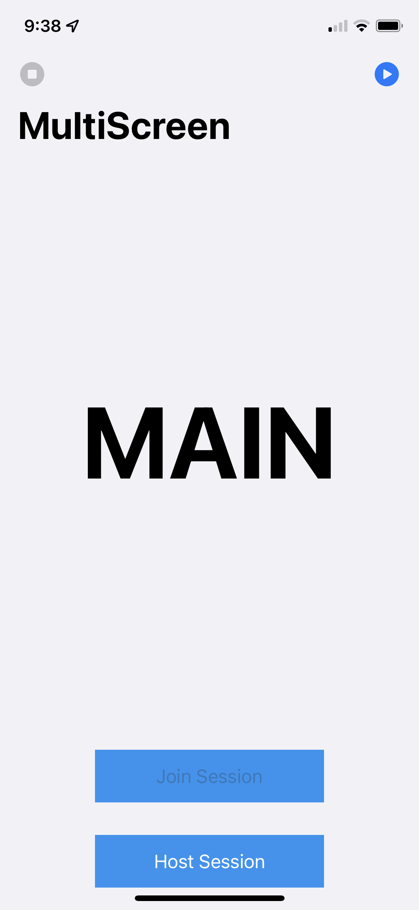
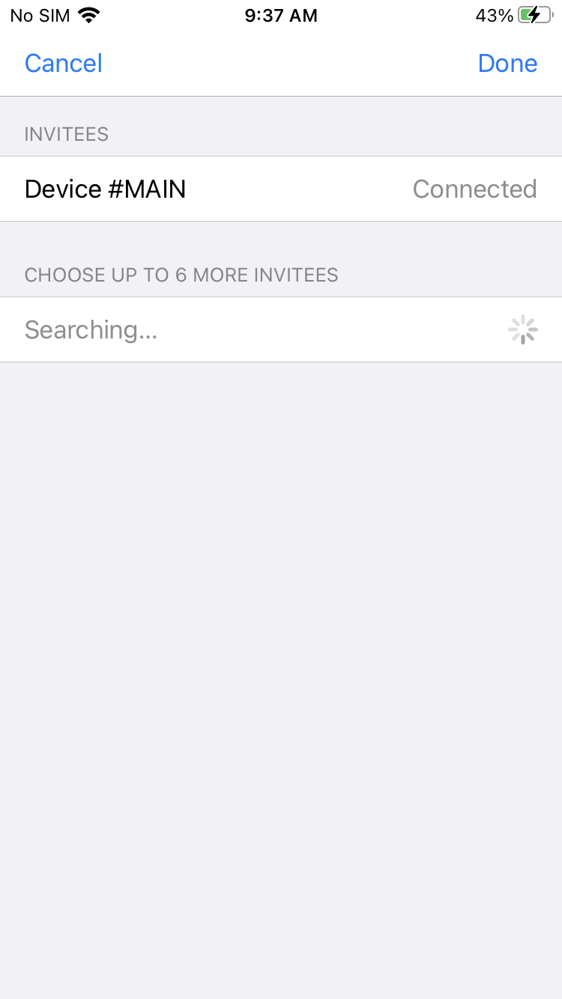

# MultiScreenApp
An app that uses Multipeer Connectivity to play a video across 6 different iOS screens with an additional phone acting as a Main/Control phone. 

## How it works
- 6 phones act as one big screen while a 7th phone sends commands to play/pause using the Multipeer Connectivity framework. 
- The 7th (Main) phone starts a session while the other 6 phones join that session.
- Each of the 6 phones has the same video file saved locally, and once they receive the play command, they each play 1/6 of the video, respective of their position.
- Using Multipeer Connectivity allows for offline usage. 

    
   

## Credits
- Shoutout to Luke Miani and Noah Rubin! Check out their video where they connected 100(!) iPhones together - https://youtu.be/RgAP6ik0454 
- SPAlert for providing fallback for errors/displaying messages on screen - https://github.com/ivanvorobei/SPAlert
